# rails-review-agents

Multi-lens code review for Ruby on Rails changes, built as Claude Code subagents.

Six narrow reviewers look at a change from different angles. An orchestrator decides which of them are relevant, runs them without letting them see each other's work, merges what they find, re-checks anything serious against the real files, and reports with a confidence level. Nothing in here edits code.

## Why it is built this way

Most attempts at AI code review fail the same way. You point a model at a diff, it produces a list, half the list is wrong, and after two weeks nobody reads the output. The design below exists to avoid that.

**A model reviewing its own work agrees with itself.** Asking the same model to check what it just produced gets you agreement, not review. Independent reviewers with narrow scopes disagree with each other, and the disagreement is where the value is.

**The reviewers must not see each other's output.** This is the part that is easy to get wrong while writing the orchestration. If the lenses run in sequence and share a transcript, the second one reads the first one's findings and anchors on them. You end up with one opinion wearing six hats. They run against the change and nothing else, and their results meet for the first time in the merge step.

**Agreement between independent lenses is evidence.** When two reviewers with different scopes land on the same line for different reasons, that is worth more than either finding alone, and the merged finding is reported with higher confidence. This signal is free and most pipelines throw it away by deduplicating silently.

**Correlated blind spots are the real failure mode.** Running six passes on the same model is not six opinions, it is one opinion repeated. Where it matters, a reviewer is pinned to a different model from the one that produced the change, so the gaps are less likely to line up. Within one vendor's models this helps less than using a genuinely different family would, so treat it as a reduction in correlation rather than a cure.

**One pass is framed adversarially.** "Review this change" and "find what is wrong with this change" produce measurably different lists. Both framings are useful, so both are used and the results are merged rather than averaged.

**Serious findings get verified before they are reported.** Most false positives come from a model reasoning about code it only half-read. Anything heading for high severity goes back to the files, reads the surrounding code, and either confirms itself or is dropped. This step costs time and removes most of the embarrassment.

**A confident false positive costs more than a miss.** This is the economic claim the whole design rests on. A missed bug costs you one bug. A confident wrong finding costs you the reviewer's trust, and after the second one people stop reading the output, at which point the tool is worth nothing and every future bug is missed too. So the pipeline is tuned for precision over recall, and it would rather say nothing than say something shaky.

**Low confidence is reported as low confidence.** Findings carry a calibrated level, and below the threshold the orchestrator stops guessing and asks a human. An agent that says "I am not sure about this one, look here" is more useful than one that is always certain.

**Reviewers do not edit.** They have Read, Grep, Glob and Bash, and no editing tools. The decision to change code stays with a person, which is also what keeps the output honest: a reviewer that cannot fix things has no incentive to prefer the findings it knows how to fix.

Worth being exact about this, because "read-only" would be a stronger claim than the tool list supports: Bash is there so a reviewer can run `git diff`, read a schema or search the tree, and a shell can obviously write files if a model decides to. The editing tools are withheld and every agent is told not to change anything, but the guarantee is one of instruction and least privilege, not a sandbox. If you need it to be a hard boundary, remove Bash from the agents that do not need it and give them the specific commands instead.

## The pipeline

```mermaid
flowchart TD
    A[Change] --> B[Scope: pick the relevant lenses]
    B --> L1[query]
    B --> L2[auth]
    B --> L3[migration]
    B --> L4[jobs]
    B --> L5[test]
    B --> L6[payments]
    L1 --> M[Merge]
    L2 --> M
    L3 --> M
    L4 --> M
    L5 --> M
    L6 --> M
    M --> V{Verify against the files}
    V -->|confirmed| C[Calibrate confidence]
    V -->|not confirmed| X[Dropped, never reported]
    V -->|cannot tell from the code| Q[Question for a human]
    C --> R[Report]
    Q --> R
```



The part the diagram cannot show is the absence: the lenses never see each other's output. They meet for the first time at the merge.

1. **Scope.** Look at what actually changed and pick the relevant lenses. A migration-only change does not pay for a payments review.
2. **Independent review.** The chosen lenses run against the change, each blind to the others.
3. **Merge.** Collapse duplicates, and raise confidence where two lenses agree for different reasons.
4. **Verify.** Every candidate blocker and important finding goes back to the files for confirmation. Unconfirmed findings are demoted to questions.
5. **Calibrate.** Attach a confidence level. Below the threshold, say so rather than rounding up.
6. **Report.** Findings first, then the questions a human needs to answer.

## The lenses

Each reviewer owns a small number of checks. This is deliberate. A single reviewer with forty checks does all of them badly, because attention is finite for models the same way it is for people. A reviewer with eight checks does those eight well.

| Agent | Owns |
|---|---|
| `query-reviewer` | N+1, missing indexes, unscoped reads, Ruby-side aggregation, unbounded collections |
| `auth-reviewer` | ownership checks, policy scoping, cross-tenant access through body parameters, mass assignment |
| `migration-reviewer` | locking migrations, unsafe column changes, backfills, indexes on large tables |
| `jobs-reviewer` | enqueue inside a transaction, object arguments, retry safety, queue starvation, dead letters |
| `test-reviewer` | missing failure cases, assertions that cannot fail, the untested error path |
| `payments-reviewer` | idempotency, database-level uniqueness, money types, append-only history, reconciliation |

Two of these are the ones most codebases do not have.

`payments-reviewer` exists because money bugs are quiet. A wrong total does not raise an exception. It sits in the database looking like data until somebody reconciles, which is often months later and usually a customer.

`jobs-reviewer` exists because asynchronous bugs do not reproduce. A job enqueued inside a transaction that later rolls back will run against a record that does not exist, and it will do that only under the timing that produced the rollback. These are the bugs that get closed as "could not reproduce" and reopened every few months.

### What is deliberately not here

No cache lens and no API contract lens, although both matter. Cache keys and response shapes are where codebases differ most from each other, so a generic version would be vague enough to be noise. Those are the first two things worth writing yourself, which is the point of the next section.

## Adapting this to your codebase

These agents encode conventions that are general to Rails. That makes them useful on day one and limited after that.

The real leverage is in encoding the conventions of *your* codebase: the scopes you already have for eager loading, the base classes your services inherit from, the response shape your API has settled on, the three things your team gets wrong in every other pull request. An agent that knows those stops being a linter and starts being a reviewer who has worked on the project.

The habit worth stealing is smaller than the tooling: **when you notice you are explaining the same thing to an agent for the second time, that explanation is a thing to build, not a thing to repeat.** Most of what is in here started as something I typed twice.

### Writing a lens of your own

Four things separate a reviewer that gets read from one that gets muted:

1. **A narrow scope, named out loud.** Eight checks, not forty. If you cannot write the list of what it owns in one line, it owns too much.
2. **Examples of both sides.** The wrong code and the right code, in your project's idiom. A rule stated in prose gets interpreted; a pair of examples does not.
3. **A verification step before reporting.** Say what the reviewer must go and read before it is allowed to call something serious. This is the single highest-value paragraph in any of these files.
4. **A way to say "I don't know".** Give it a questions section and permission to use it. A reviewer with no way to express doubt will express confidence instead.

The failure mode to design against is not a missed bug, it is a lens whose output people skim.

## Knowing whether it works

The claim this pipeline rests on is measurable, so measure it. Track what fraction of reported findings the author acts on and what fraction they dismiss.

A rising dismissal rate is the early warning. It means the thing is drifting toward confident noise, and the fix is to raise the confidence threshold or narrow whichever lens is producing the dismissals, not to add more checks. If you are not watching that ratio, you will find out the pipeline stopped being useful about six months after it stopped being useful.

## Using it

Copy `agents/` and `skills/` into your project's `.claude/` directory, then either name the lenses you want:

```
Review this change with the payments lens and the jobs lens.
```

or run the whole pipeline:

```
/review-change
```

## What this does not do

It does not replace RuboCop, Brakeman or a type checker. Those are cheaper, faster and exact, and anything they can catch should be caught by them instead.

It does not replace human review on anything irreversible. The rule I apply is that leverage from a model scales with how cheaply you can verify its output. Scaffolding, tests, documentation and review are cheap to check, so they are worth automating hard. A change to a payment path is the opposite: the failure mode is not a crash, it is somebody's money, and the feedback arrives quietly and late. There I use agents to read and to reason, not to decide.

## License

MIT.
